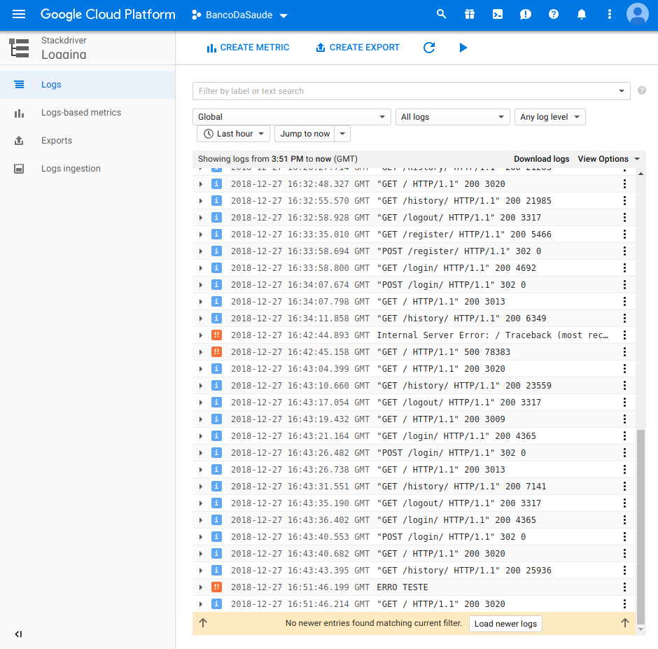

# Logging for mx3produto

Python logging library (linked to stackdriver logging) + audit logging

### Import Library

``` python
from mx3produto.logging import Logger,AUDIT_ACTIONS
logger = Logger(__name__) # on Django name will be app.file (example:users.views)
```

 On Stackdriver *python_logger* will be *\__name__*

### Logging usage

Logging on Stackdriver has 5 levels: Ordered

```python
# Ordered by logging level
logger.debug(message)
logger.info(message)
logger.warn(message)
logger.error(message)
logger.critical(message)

# como boas práticas e para facilitar a busca posterior recomendo
# a seguinte forma de estruturar a mensagem

logger.error("function_name: informacoes do erro, Valores: {}".format(valores))

#exemplo
logger.critical("update_inventory_db: Multiple products with same warehouse and med; warehouse: {}, med: {}".format(warehouse,med))
```

All the other methods available in the Logger Class of the python logging library are also available.

### Audit Logging 

**To prevent errors in the action field I provided an class object to be used while audit logging**

```python
# Ações possíveis
AUDIT_ACTIONS.create
AUDIT_ACTIONS.modify
AUDIT_ACTIONS.read
AUDIT_ACTIONS.delete
```

This function is design to be called in the *views.py* file

```python
'''
audit(request,action,screen,entity,attribute=None,old_attribute=None,other=None)
Atributos Obrigatorios:
######################
request -> request object, da função no ficheiro view
action -> a ação efectuada pelo utilizador, pode ser create,modify,read,ou delete
Atributos Opcionais:
###################
screen -> Ecrã aonde a acao foi realizada
object -> Objecto em qual a ação tomou lugar
object_attribute -> Atributo do valor que identifica a instância
object_instance -> Valor que identifique a instância do Objecto

changed_attribute -> atributo no qual foi alterado o valor
new_value -> Valor atual
old_value -> valor anterior a ser alterado
other -> outras coisas que sejam pertinentes guardar na base de dados
'''
### EXEMPLOS
##################

# criacão de uma encomenda
logger.audit(request,AUDIT_ACTIONS.create,screen="Encomendar Medicamento", object="Encomenda",object_attribute="Número da encomenda", object_instance="1234")

# associacao do utente à encomenda
logger.audit(request,AUDIT_ACTIONS.modify,screen="Encomendar Medicamento", object="Encomenda",object_attribute="Número da encomenda", object_instance="1234",
changed_attribute="Nif Utente",new_value="226845398")

# Alteracao de nr telemovel utente
logger.audit(request,AUDIT_ACTIONS.modify,screen="Consulta de Utente", object="Utente", object_attribute="nif",object_instance="226853942", changed_attribute="Telemovel", new_value="91000000", old_value="96000000")

# Consulta do historico
logger.audit(request, AUDIT_ACTIONS.read, screen="Histórico", object="Histórico", other="search:"+search)

# Apagar uma farmacia
logger.audit(request,AUDIT_ACTIONS.delete, screen="Gestor de Farmácias", object="Farmácia",object_attribute="Nome",object_instance="Farmácia Ana Silva")
```


## Log into Stackdriver Logging

#### Set in the Django Settings LOG_TO_CLOUD to True

```python
# settings.py
# turn this on to log into stackdriver
LOG_TO_CLOUD=True
```

This should be set to true in production

### Setting up Google Cloud Credentials

To properly log into Stackdriver we need to get the service account key

**First you need to create a new key for *StackDriver Monitoring* in the service account area ** 


**With a JSON key type**


**Then after downloading the credential, set the following path in the terminal**

```bash
# on terminal before running or set it in .bashrc once
export GOOGLE_APPLICATION_CREDENTIALS="/path/to/credentials/credentials.json"
```

### View Logs on Stackdriver Logging

**Go to Logging in the cloud console and set the resource selector to Global**



#### Logging Filters Example


There you should be able to see all django app logs up to 30 days 

You could also search for the log text


**To view audit logs simply go to /history as a superuser**

---

Sugestões ou algo mandem me mensagem para o [slack](https://mx3produto.slack.com/messages/DEKQD710E) ou email: bernardoesteves97@gmail.com


